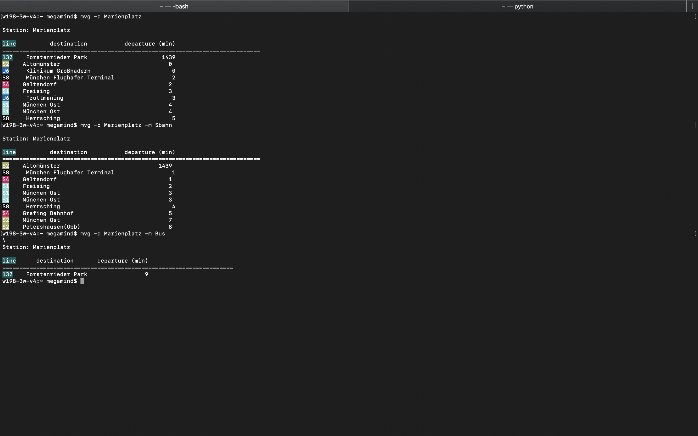

# A console program to request the departure time from the MVG

This python script is a Command Line wrapper to get the departures from any station/stop in the MVG(Münchner Verkehrsgesellschaft) network.

## Getting started
We're on PyPi! Installing using pip.

`pip install mvg-console`

## Usage
```
usage: mvg [-h] [--version] [--recent]
           [--departures DEPARTURES [DEPARTURES ...]] [--limit LIMIT]
           [--mode MODE] [--search SEARCH [SEARCH ...]]

optional arguments:
  -h, --help            show this help message and exit
  --version, -v         Version Info.
  --recent, -r          fetch the most recent search.
  --departures DEPARTURES [DEPARTURES ...], -d DEPARTURES [DEPARTURES ...]
                        Departures at Station/Stop
  --limit LIMIT, -l LIMIT
                        # results to fetch
  --mode MODE, -m MODE  Transportation Mode: bus, ubahn, sbahn, tram.
  --search SEARCH [SEARCH ...], -s SEARCH [SEARCH ...]
                        Gets stations closest to the address.
```

## Demo


## Changelog
#### 12.11.2018
* We're on PyPi! Now you can easily install the script using pip!
* You can now search for the nearest station/stop from an address! Use the --search/-s [adress]
* You can choose the Transportation mode to be displayed using the --mode/-m arguement. Available modes: bus, ubahn, sbahn, tram.
* A lot of Bug Fixes.
